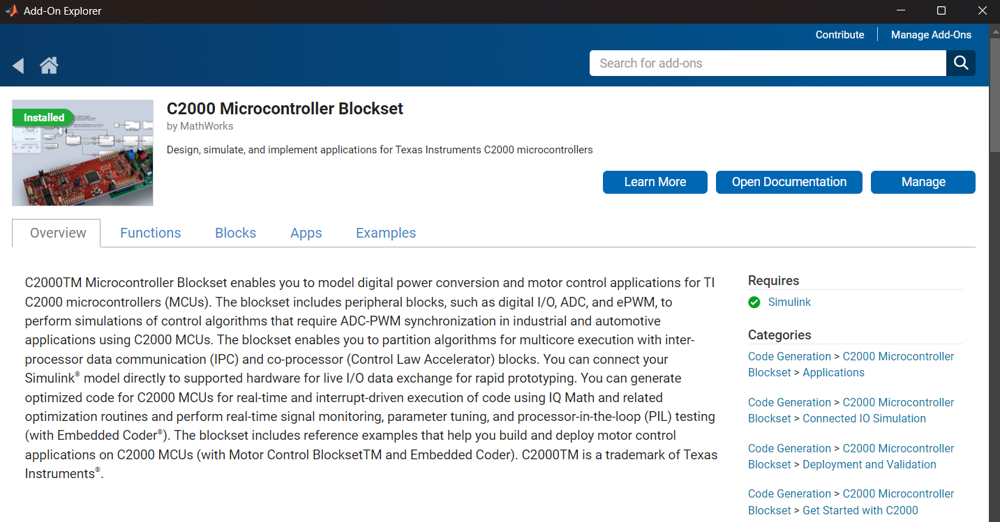
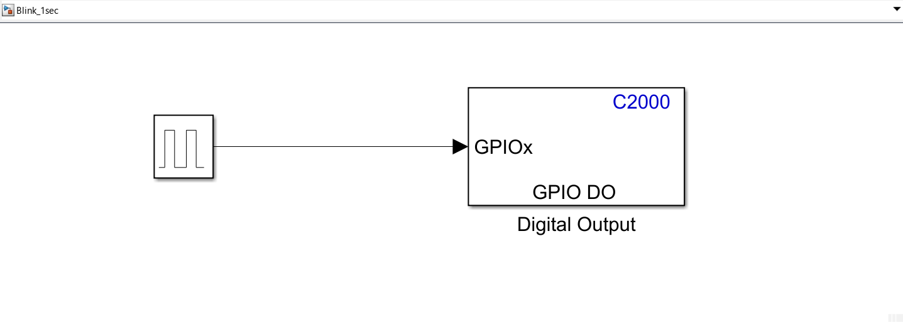
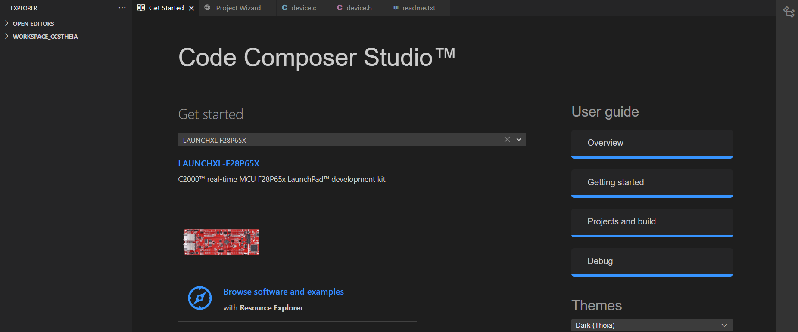

# Vehicle Control Unit
This is the GitHub Repo for the Vechile Control Unit for Fall 2025. This ReadMe will include how to set up the devolpment Enviroment for programming using the Simulink and MatLab coder. 
## How to set up Simulink Enviroment (Recommended First step)
The easiest way to program the Ti Launchpad with the F28P65X real time chip is using Simulink and is how most if not all VCU are programmed in industry. For a quick video guide on how to set it all up, I found this very useful and short [Youtube Video.](https://youtu.be/kQnS6ZIH6XY?si=LmnyyzGGfMcHRUjn) To begin, you will need to verify that you have both MatLab and Simulink on your device, if not, you can find the donwload link [Here.](https://oit.colorado.edu/software-hardware/software-catalog/matlab) Scroll to the part on *How to get it* and log into the portal to download. 

### MatLab Download 
When downloading Matlab, you will have the option to download the `c2000 Microcontroller Blockset` in the **Products** which is nessary in order program the SDK (If you already had MatLab installed, no worries, you can install this in MatLab by going to **Home->Add-Ons->Explore Addons**, and looking up `c2000 Microcontroller Blockset`). 

### C2000 setup instruction
After Downloading Matlab, you should see a button for Simulink on the Home Tab. After opening up Simulink, you will see a slew of different On-Ramping tutorials. Do these at your own leasure if you want to learn more about how to make different subsytems in Simulink or are looking for a good starting point. Afterwards, refer back to Matlab and run the `c2000setup` command, since this will help you install the proper depedancies needed for the SDK. When selecting the Processor family, choose ***F28P65X*** since this is the model we are using. following this setup to download all the proper Hardware, it will tell you download items like c2000Ware, controlSUITE and Code Composer Studio.

### Install of Code Composer Studio
For the Code Composer Studio (CSS), I would recommend download Version 20.0.1, even if you are not currently planning on using Simulink, since if we ever move to Simulink only coding or want to mess with Simulink, that is the recommended version used by the isntaller and will get upset if the version you have does not match. The download link can be found [here.](https://oit.colorado.edu/software-hardware/software-catalog/matlab)

## Validation and test run
After doing all the downloads, it will ask to verify the path so that it knows were to pull the packages from. After this, you should be all ready to go! Now, you can open up a new Blank Model in simulink to do some testing. After opening a new project, go to the Modeling tab, and click on **Model Settings->hardware Implementation** and make sure the board listed under Hardware board says: *TI F28P65x* and choose which core you are trying to upload the code you write (c28xCPU1 should be the default). Afterwards, go the Simulation tab, click on Library Brower, and go to **Library->c2000 Microcontroller Blockset->F28p65x->Digital Output**, and add a GPIO Block so we can blink some LEDs. 

Afterwards, add a Pulse generator by Double clicking anywhere in the digram and typing in *Pulse Generator*, set the period to 1, and the Pulse Width to 50 (50 of the time on, 50 of the time off). Then connect the blocks as shown below, and left click on the GPIO block to select which pins to interact with, which should be pin 12 and 13 for our board.   

After all of this has been set up, in the hardware tab, click on *Build, Deploy and Start* which should now upload all of the code onto the board and you should see the two LEDs blink on and off every half second. **NOTE:** If you are having a issue similar to `Error:MATLAB Coder, Simulink Coder and Embedded Coder products are required to generate code for this hardware board. Install the required products.`, they contact OIT in order to active your license. Now you have offically finished setting up the enivroment! 

## How to set up CCS Enviroment 
In the case that you would perfer not use Simulink, you can also manually program the board using Ti's Code Complier Studio (CCS). In the previous setup, I walked through how to download and which version to download so I recommend checking that out first. Their is also a short video on how to set up your first project if you perfer that [here](https://www.youtube.com/watch?v=dRfy56uXSOc)

### Creating new Project
After opening CCS, you will see the getting started screen with the option of Board Selection and additonal useful links (Software examples, learning about c2000 mcu, and new project creation). Start off by choosing the board we are using, which should autofill upon being connected or just type in *LAUNCHXL F28P65X*, it should look something like this afterwards: 

Afterwards, look in the project wizard for a function called `led_ex1_blinky` and create that directory. It will probably ask you to download a lot of dependances, go ahead and go through with that. Afterwards, click on the **Run** button up on the top and then click *Flash Project* of Ctrl + F5. You should see the code being flashed in the terminal, and then, Ta-Da! You should now have a blinking LED! 

